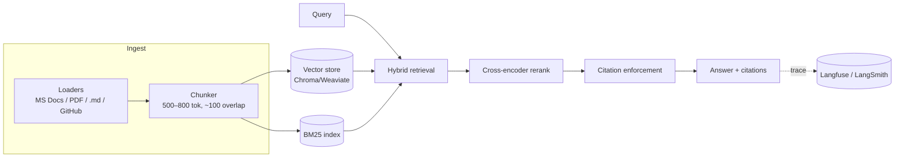

# prod-rag — Production-Grade RAG with Observability & CI Gating

A domain-specific **"Ask My Docs"** system: hybrid retrieval (BM25 + vector),
cross-encoder reranking, **citation enforcement** (refuses to answer when evidence is
insufficient), a **CI-gated evaluation pipeline**, and full **tracing / cost / latency
observability**.

> Combines two portfolio projects in one codebase because the observability layer
> instruments this exact pipeline. The git history/tags show the progression:
> `v0.2` = production RAG (Project 1), `v1.0` = full observability + regression gating (Project 3).

## Architecture



## Results scoreboard

<!-- Fill in with real numbers from `eval/run_ragas.py` -->

| Metric | Baseline (v0.1) | Hybrid + rerank (v0.2) | Target |
|--------|-----------------|------------------------|--------|
| Faithfulness | — | — | ≥ 0.90 |
| Answer relevance | — | — | ≥ 0.85 |
| Context precision | — | — | ≥ 0.80 |
| Citation coverage | — | — | ≥ 0.95 |
| p50 / p90 latency | — | — | — |
| Cost / request | — | — | — |

## Roadmap (tags)

- `v0.1` — top-k vector retrieval + generation (fundamentals)
- `v0.2` — hybrid retrieval + cross-encoder reranker + citation enforcement + versioned prompts
- `v0.3` — Ragas offline eval + golden dataset + CI gate
- `v1.0` — full tracing, cost/latency dashboards, prod regression gating

## Stack

- **Orchestration:** LangChain / LangGraph
- **Vector store:** ChromaDB (swap-able to Weaviate)
- **Reranking:** Cohere Rerank or open-source cross-encoder (sentence-transformers)
- **Evaluation:** [Ragas](https://docs.ragas.io/)
- **Observability:** [Langfuse](https://langfuse.com/docs) (self-hosted) — LangSmith adapter optional

## Quickstart

```bash
python -m venv .venv && .venv\Scripts\activate   # Windows
pip install -e ".[dev]"
cp .env.example .env                              # add API keys
python -m rag.ingest.loaders --source docs/       # build indexes
python -m rag.generate.answer "How do I ...?"     # ask a question
python eval/run_ragas.py                          # run the eval suite
```

## Layout

```
src/rag/
  ingest/        # loaders + chunker
  index/         # vector store + bm25
  retrieve/      # hybrid fusion + cross-encoder rerank
  generate/      # answer synthesis + citation enforcement
  observability/ # tracing wrappers + metrics
prompts/         # versioned prompt configs (treated as code)
config/          # retrieval params + thresholds
eval/            # golden dataset + Ragas runner
.github/workflows/eval.yml   # CI gate: fails PR if faithfulness < threshold
```
