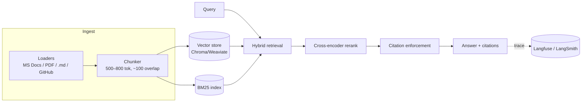
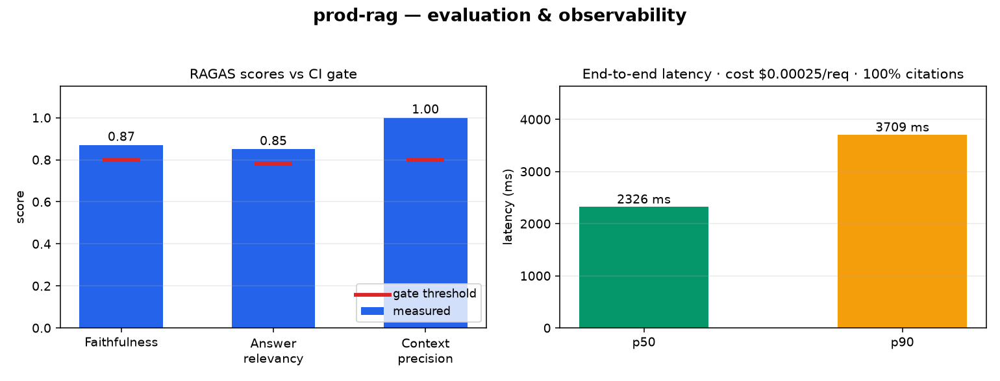

# prod-rag — Production-Grade RAG with Observability & CI Gating

[](https://github.com/mimuruth/prod-rag/actions/workflows/lint-test.yml)
[](https://github.com/mimuruth/prod-rag/actions/workflows/eval.yml)


[](https://github.com/mimuruth/ai-portfolio/tree/main/book)

A domain-specific **"Ask My Docs"** system: hybrid retrieval (BM25 + vector),
cross-encoder reranking, **citation enforcement** (refuses to answer when evidence is
insufficient), a **CI-gated evaluation pipeline**, and full **tracing / cost / latency
observability**.

> Combines two portfolio projects in one codebase because the observability layer
> instruments this exact pipeline. The git history/tags show the progression:
> `v0.2` = production RAG (Project 1), `v1.0` = full observability + regression gating (Project 3).

> ▶️ **90-second walkthrough** — _Loom demo coming soon._
> <!-- When recorded, replace the line above with:
> ▶️ **[90-second walkthrough](PASTE_LOOM_URL_HERE)** — a quick tour of all five portfolio projects. -->
>
> 🔗 **Live demo:** https://prod-rag.lemonstone-a5ab9349.eastus.azurecontainerapps.io &nbsp;·&nbsp; `GET /healthz` · `POST /ask` (Azure Container Apps)

Try the live API:

```bash
curl -X POST https://prod-rag.lemonstone-a5ab9349.eastus.azurecontainerapps.io/ask \
  -H "Content-Type: application/json" \
  -d '{"question":"What is Azure Container Apps?"}'
# -> {"answer": "...", "citations": [ ... ]}
```

## Architecture



## Results scoreboard



📎 **Engineering notes:** [scope & success criteria](docs/SCOPING.md) · [decisions, trade-offs & incident log](docs/DECISIONS.md)

Measured by `eval/run_ragas.py` over the golden set (Ragas, gpt-4o-mini judge). Corpus: 4 real
Azure Learn docs (Functions, Container Apps, Blob Storage) + the system doc; 32 golden QA pairs.
Thresholds are calibrated just below the measured baseline and enforced by the CI eval gate:

| Metric | Score | Gate threshold |
|--------|-------|----------------|
| Faithfulness | 0.87 | ≥ 0.80 |
| Answer relevancy | 0.85 | ≥ 0.78 |
| Context precision | 1.00 | ≥ 0.80 |

> The **gate is live**: a regression below any threshold fails the build. Numbers rise and
> stabilize further as the corpus and golden set grow.

## Roadmap (tags)

- `v0.1` — top-k vector retrieval + generation (fundamentals) ✅
- `v0.2` — hybrid retrieval + cross-encoder reranker + citation enforcement + versioned prompts ✅
- `v0.3` — Ragas offline eval + golden dataset + CI gate ✅
- `v1.0` — full tracing, cost/latency dashboards, prod regression gating ✅

## Observability & evaluation

- **Tracing** — every request emits a Langfuse trace with per-stage spans (retrieve,
  generate), token usage, and cost. Set `LANGFUSE_*` in `.env`; tracing no-ops if unset.

  Self-host Langfuse and view traces locally:

  ```bash
  docker compose -f docker-compose.langfuse.yml up -d      # postgres + clickhouse + redis + minio + langfuse
  # open http://localhost:3000, create a project, copy the public/secret keys, then in .env:
  #   LANGFUSE_PUBLIC_KEY=pk-lf-...
  #   LANGFUSE_SECRET_KEY=sk-lf-...
  #   LANGFUSE_HOST=http://localhost:3000
  python -m rag.generate.answer "What is Azure Container Apps?"   # traces now appear in the UI
  ```

- **Metrics dashboard** — each request is recorded to `.metrics/requests.jsonl`; roll up
  p50/p90 latency, cost/request, citation coverage, and failure rate:

  ```bash
  python -m rag.observability.metrics
  ```

  Measured over 8 grounded queries against the Azure-docs corpus:

  | p50 latency | p90 latency | avg cost/request | citation coverage | failure rate |
  |-------------|-------------|------------------|-------------------|--------------|
  | 2326 ms | 3709 ms | $0.00025 | 100% | 0% |

- **CI eval gate** — `eval/run_ragas.py` ingests the corpus, runs the pipeline over the
  golden dataset, and scores faithfulness / answer relevancy / context precision against
  the thresholds in `config/retrieval.yaml`. On a PR it **blocks the merge** if any metric
  regresses (branch protection requires the `eval` check).

## Deploy to Azure Container Apps

The repo ships a `Dockerfile` and a FastAPI wrapper (`api.py` — `POST /ask` + `GET /healthz`),
so it is a few commands from a live endpoint. The container builds its indexes from `docs/`
on first boot, then serves on `:8000`.

**1. Sign in and pick the subscription**

```bash
az login
az account show --query name
```

**2. Deploy** — cloud-builds the `Dockerfile` (no local Docker needed):

```bash
az containerapp up \
  --name prod-rag --resource-group rg-prod-rag --location eastus \
  --source . --ingress external --target-port 8000
```

`az containerapp up` auto-installs the Container Apps extension and registers providers on first run.

**3. Add `OPENAI_API_KEY` as a secret, then reference it** (keeps the key out of shell history):

```bash
az containerapp secret set --name prod-rag --resource-group rg-prod-rag \
  --secrets openai-key=<paste-your-OpenAI-key>
az containerapp update --name prod-rag --resource-group rg-prod-rag \
  --set-env-vars OPENAI_API_KEY=secretref:openai-key
```

Add `LANGFUSE_PUBLIC_KEY` / `LANGFUSE_SECRET_KEY` / `LANGFUSE_HOST` the same way to stream traces.

**4. Get the URL and smoke-test it:**

```bash
FQDN=$(az containerapp show --name prod-rag --resource-group rg-prod-rag \
  --query properties.configuration.ingress.fqdn -o tsv)
curl "https://$FQDN/healthz"
curl -X POST "https://$FQDN/ask" -H "Content-Type: application/json" \
  -d '{"question":"What is Azure Container Apps?"}'
```

The first `/ask` may be slow while indexes build — that's expected. Put the resulting URL in the
**Live demo** line at the top of this README.

**Deploy from GHCR instead of building** — once the package is public, swap `--source .` for
`--image ghcr.io/mimuruth/prod-rag:v1.0.0` (pushing a `vX.Y.Z` tag triggers the `docker` workflow
that publishes to `ghcr.io/mimuruth/prod-rag`). Run it locally the same way with `make serve`
(or `uvicorn api:app --reload`).

## Stack

- **Pipeline:** direct OpenAI (`gpt-4o-mini`) generation over a custom hybrid retriever
- **Vector store:** ChromaDB (swap-able to Weaviate)
- **Reranking:** Cohere Rerank or open-source cross-encoder (sentence-transformers)
- **Evaluation:** [Ragas](https://docs.ragas.io/)
- **Observability:** [Langfuse](https://langfuse.com/docs) (self-hosted) — LangSmith adapter optional

## Quickstart

```bash
python -m venv .venv && .venv\Scripts\activate   # Windows
pip install -e ".[dev]"
cp .env.example .env                              # add API keys
python -m rag.ingest.loaders --source docs/       # build indexes
python -m rag.generate.answer "How do I ...?"     # ask a question
python eval/run_ragas.py                          # run the eval suite
```

## Layout

```
src/rag/
  ingest/        # loaders + chunker
  index/         # vector store + bm25
  retrieve/      # hybrid fusion + cross-encoder rerank
  generate/      # answer synthesis + citation enforcement
  observability/ # tracing wrappers + metrics
prompts/         # versioned prompt configs (treated as code)
config/          # retrieval params + thresholds
eval/            # golden dataset + Ragas runner
.github/workflows/eval.yml   # CI gate: fails PR if faithfulness < threshold
```

---

*Part of the [AI Engineering Portfolio](https://github.com/mimuruth/ai-portfolio) — [prod-rag](https://github.com/mimuruth/prod-rag) · [local-slm-lab](https://github.com/mimuruth/local-slm-lab) · [llm-finetuning](https://github.com/mimuruth/llm-finetuning) · [realtime-voice](https://github.com/mimuruth/realtime-voice).*
